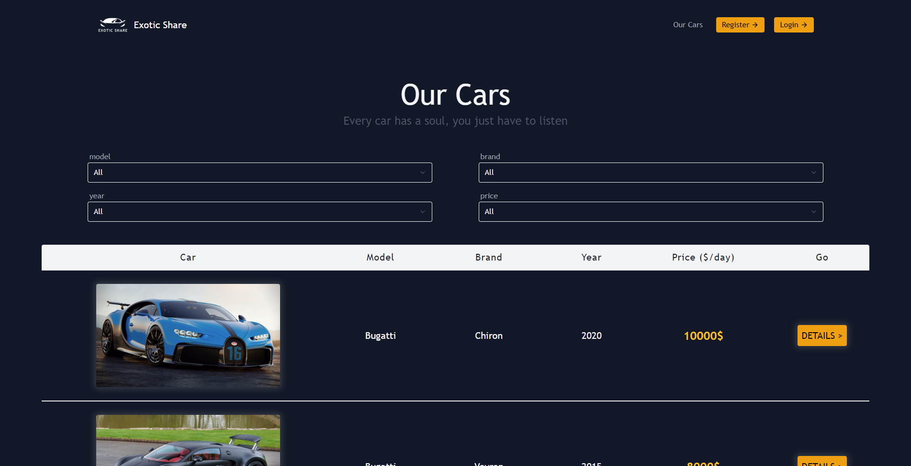
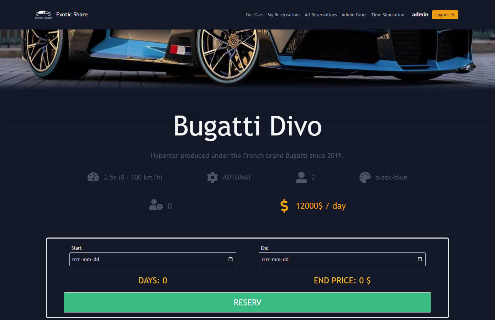

# Car-Sharing
Car sharing - school project

## Installation

 - Clone/download the repository
 - Prepare the database (.sql file in directory `\Database`)
 - In `\Project`:
   - In terminal run `npm i` to install dependencies
   - In the terminal run `npm run build` to build project
   - Run `\public\index.html` with php server (e.g. XAMPP)
    

## Features

- Login/Registration
- Account types (Client/Mod/Admin)
- Car Reservation
- User management
- Simulation of time lapse
- Pseudo qr code of a reservation in progress

## Accounts rights

### Client:
- car reservation
- browsing available cars
- managing own reservations
- access to qr code
- possibility to return the car

### Mod:
- client rights
- management of all reservations

### Admin:
- client and mod rights
- user management
- access to time simulation
